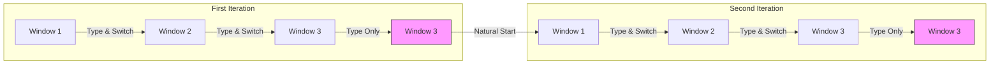
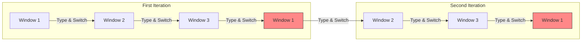

# Window Switching Flow Patterns

## Current Optimized Pattern

```mermaid
graph LR
    subgraph "First Iteration"
        W1[Window 1] -->|Type & Switch| W2[Window 2]
        W2 -->|Type & Switch| W3[Window 3]
        W3 -->|Type Only| W3_END[Window 3]
    end
    
    subgraph "Second Iteration"
        W3_END -->|Natural Start| W1_2[Window 1]
        W1_2 -->|Type & Switch| W2_2[Window 2]
        W2_2 -->|Type & Switch| W3_2[Window 3]
        W3_2 -->|Type Only| W3_END2[Window 3]
    end
    
    style W3_END fill:#f9f,stroke:#333
    style W3_END2 fill:#f9f,stroke:#333
```

## Unoptimized Pattern (Without Last Window Check)

```mermaid
graph LR
    subgraph "First Iteration"
        UW1[Window 1] -->|Type & Switch| UW2[Window 2]
        UW2 -->|Type & Switch| UW3[Window 3]
        UW3 -->|Type & Switch| UW1_EXTRA[Window 1]
    end
    
    subgraph "Second Iteration"
        UW1_EXTRA -->|Type & Switch| UW2_2[Window 2]
        UW2_2 -->|Type & Switch| UW3_2[Window 3]
        UW3_2 -->|Type & Switch| UW1_EXTRA2[Window 1]
    end
    
    style UW1_EXTRA fill:#f88,stroke:#333
    style UW1_EXTRA2 fill:#f88,stroke:#333
``` 